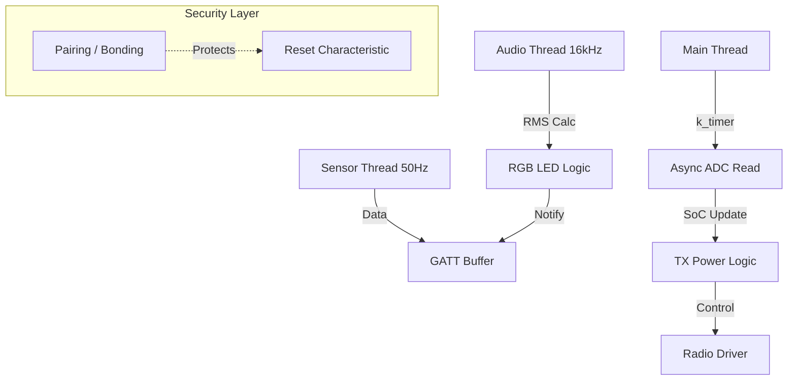

# Projekt-Analyse & Optimierungsplan: nRF52840 Sensor Hub

Dieses Dokument enthält eine detaillierte technische Analyse des aktuellen Projektstands sowie einen Fahrplan für notwendige Verbesserungen in den Bereichen Sicherheit, Stabilität und Energieeffizienz.

---

## 1. IST-Zustand & Funktionalität

### Hardware-Plattform
*   **MCU:** Nordic Semiconductor nRF52840 (ARM Cortex-M4F).
*   **Board-Layout:** Basierend auf dem **Seeed Studio XIAO nRF52840 Sense**.
*   **Peripherie:** 
    *   LSM6DSL IMU (Beschleunigung & Rotation).
    *   PDM Mikrofon für Audio-Level-Monitoring.
    *   ADC für Batteriespannungsmessung (AIN7/P0.31).
    *   RGB LED zur Status- und Audio-Visualisierung.
    *   NFC-Antenne für URI-Emulation.
    *   USB (CDC ACM) für Konsole/Logging.

### Software-Stack
*   **OS:** Zephyr RTOS.
*   **Connectivity:** BLE (Peripheral Role), NFC (Tag 2 Type Emulation), USB Stack.
*   **Threading:** Multi-threaded Design mit separaten Threads für Audio (`audio_thread`) und Sensoren (`sensor_thread`).
*   **Web-Frontend:** Web-Bluetooth Dashboard mit Echtzeit-Graphen und einer (simulierten) Spektrogramm-Anzeige.

### Funktionalität
1.  **Sensordatenerfassung:** Beschleunigungs- und Rotationsdaten werden mit ~50Hz erfasst und per BLE Notify gestreamt.
2.  **Audio-Visualisierung:** Das Mikrofon berechnet den RMS-Pegel, steuert die RGB-LED (Farbverlauf von Blau nach Rot) und sendet den Pegel an das Dashboard.
3.  **Power-Management:** Dynamische Anpassung der Sendeleistung (TX Power) basierend auf dem SoC (State of Charge) der Batterie.
4.  **Wartung:** Fernsteuerung des Resets in den Bootloader via BLE-Charakteristik.

---

## 2. Identifizierte Schwachstellen

### A. Code-Struktur & Wartbarkeit
*   **Hardcodierte GATT-Indizes:** Im `main.c` wird auf Attribute via Index zugegriffen (z.B. `&custom_svc.attrs[14]`). Das ist extrem fehleranfällig; jede Änderung an der Service-Struktur führt zu Fehlern.
*   **Redundante Logik:** In der `audio_thread` und in `main` gibt es überschneidende Logiken für das Senden von Daten, die nicht konsistent geprüft werden.

### B. Energieeffizienz (Power Consumption)
*   **Blockierender Main-Loop:** Die Funktion `read_battery_voltage_impl()` blockiert den Main-Thread für ca. eine Sekunde pro Zyklus durch `k_msleep`.
*   **USB Stack:** `CONFIG_USB_DEVICE_STACK=y` ist aktiv. Der USB-Stack verhindert oft Deep-Sleep-Modi (System ON / OFF) und verbraucht signifikant Strom, auch wenn kein Kabel angeschlossen ist.
*   **Floating-Point im Audio-Thread:** Die Verwendung von `double` und `sqrt` ist dank FPU möglich, aber ineffizienter als Fixed-Point Arithmetik oder optimierte CMSIS-DSP Funktionen.

### C. Performance & Stabilität
*   **Logging:** `CONFIG_LOG_MODE_DEFERRED=n` (synchrones Logging) kann die Echtzeit-Performance beeinträchtigen, da der Prozessor auf den Abschluss der UART-Übertragung wartet.
*   **Fehlendes Error-Handling:** Viele `bt_gatt_notify`-Aufrufe prüfen den Rückgabewert nicht. Bei Verbindungsabbrüchen oder vollen Puffern kann dies zu unvorhersehbarem Verhalten führen.

---

## 3. Sicherheitslücken (Critical)

1.  **Unverschlüsselte Kommunikation (Just Works):** Es wird kein Pairing oder Bonding verwendet. Jeder in Reichweite kann die Sensordaten mitlesen.
2.  **Ungeschützter System-Reset:** Die Charakteristik zum Reset in den Bootloader ist für jeden Schreibzugriff offen (`BT_GATT_PERM_WRITE`). Ein Angreifer könnte das Gerät jederzeit remote in den Wartungsmodus zwingen oder (bei entsprechendem Bootloader) Schadcode aufspielen.
3.  **Fehlendes Authorization-Konzept:** Es gibt keine Trennung zwischen "Read-Only" (Sensordaten) und "Administrative" (Reset) Zugriffen auf Protokollebene.

---

## 4. Empfohlener Maßnahmenplan (Maßnahmen-Todo)

### Phase 1: Sicherheit (Priorität: Hoch)
*   [ ] **Passkey-Pairing:** Umstellen von "Just Works" auf Authenticated Pairing mit statischem oder dynamischem Passkey.
*   [ ] **GATT Permissions:** Den Reset-Charakteristik auf `BT_GATT_PERM_WRITE_AUTHEN` setzen, um Zugriff nur nach erfolgreichem Pairing zu erlauben.
*   [ ] **Device Privacy:** Implementierung von Privacy-Features (RPA - Resolvable Private Address), um Tracking des Beacons zu erschweren.

### Phase 2: Stabilität & Refactoring (Priorität: Mittel)
*   [ ] **GATT API Refactoring:** Umstellung auf `BT_GATT_SERVICE_DEFINE` in Kombination mit Zeiger-Referenzen statt Indizes für Notifies.
*   [ ] **Watchdog Timer (WDT):** Implementierung eines Hardware-Watchdogs, um das System bei Thread-Deadlocks (z.B. im I2C-Bus) automatisch neu zu starten.
*   [ ] **Logging Optimierung:** Umstellung auf Deferred Logging (`CONFIG_LOG_MODE_DEFERRED=y`) und Nutzung des Log-Backends über RTT (Segger Real Time Transfer) statt UART für weniger Overhead.

### Phase 3: Power & Performance (Priorität: Mittel)
*   [ ] **Non-blocking Battery Read:** Umstellung der ADC-Messung auf eine asynchrone Workqueue oder einen `k_timer`, um den Main-Loop zu entlasten.
*   [ ] **USB Auto-Detect:** USB nur aktivieren, wenn eine VBUS-Spannung erkannt wird, um im Batteriebetrieb Strom zu sparen.
*   [ ] **CMSIS-DSP Integration:** Nutzung der ARM-optimierten Library für die RMS-Berechnung im Audio-Thread.

### Phase 4: Erweitertes Web-Interface (Bonus)
*   [ ] **Echtes FFT-Streaming:** Statt der Simulation im Frontend sollten komprimierte Frequenzbänder (z.B. Oktavbänder) direkt vom nRF52 gesendet werden.

---

## 5. Mermaid Workflow (Vorgeschlagene Architektur)

